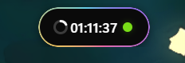

<div align="center">
  

# Wisland

一枚为 Codex、音乐与专注工作流打造的 Windows 桌面灵动岛。

[](https://github.com/Lev1z/Wisland/releases/latest)
[](https://github.com/Lev1z/Wisland/releases)

[](LICENSE)

**简体中文** · [Eng](README_EN.md)
</div>

Wisland 常驻于屏幕顶部，用一枚克制的胶囊集中呈现 Codex 状态与额度、媒体信息、Obsidian 随手记和临时文件，并提供无需离开当前工作的快捷操作。

<p align="center">
  
</p>

## 功能亮点

- **Codex 状态与额度**：显示剩余额度；状态灯以绿色、橙色和灰色区分空闲、执行中与离线。
- **音乐、歌词与控制**：读取 Windows SMTC 的歌曲、封面、进度与播放状态，支持播放控制、音量、专辑取色声波和歌词时间校准。
- **Obsidian 随手记**：向指定 Vault 快速写入日记、待办和普通记录，并管理当天条目。
- **临时文件托盘**：暂存拖入文件的路径，可再次拖出或打开，不复制和修改原文件。
- **灵活导航与外观**：在 Classic 图标栏和 Option Wheel 之间切换，支持页面排序、缩放、透明度、边框以及图片或 GIF 素材。
- **桌面行为**：支持中键锁定展开、拖动回弹、顶部最小化横条、全屏/进程黑名单、开机自启和系统托盘。
- **环境检查**：首次启动时检查 WebView2、Codex Desktop、Codex CLI、Hooks、媒体服务和 Obsidian，并提供对应修复入口。

## 下载与安装

从 [GitHub Releases](https://github.com/Lev1z/Wisland/releases/latest) 下载最新的 `Wisland_<版本>_x64-setup.exe` 并运行。

建议使用安装包，而不是单独复制构建目录中的 `Wisland.exe`；安装包能够正确配置升级、卸载和开始菜单快捷方式。

### 系统要求

- 64 位 Windows 10 或 Windows 11
- Microsoft Edge WebView2 Runtime（Windows 11 通常已包含）
- 可选：Codex Desktop 与 Codex CLI，用于状态和额度功能
- 可选：支持 Windows SMTC 的媒体播放器
- 可选：Obsidian，用于随手记功能

## 快速上手

1. 首次启动会进入环境检查；在胶囊展开状态中可查看完整结果并处理缺失项。
2. 将鼠标移入屏幕顶部中央的胶囊即可展开，移开约 0.5 秒后自动收起。
3. 在胶囊上滚动鼠标滚轮，切换时间、音乐、日记和文件托盘页面。
4. 中键单击可锁定或解除展开状态；右键打开快捷菜单。
5. 将胶囊向屏幕顶部拖动可收成小横条，单击横条即可恢复。
6. 在设置的 Codex 页面安装 Hooks，并在 Codex 提示时完成信任确认。
7. 在设置的日记页面选择 Obsidian Vault 和日记目录，即可开始快速记录。

## Codex 集成说明

Wisland 使用 Codex 生命周期 Hooks 同步任务开始与完成状态，并通过已登录的 Codex CLI 获取额度。安装 Hooks 后应完全重启 Codex，使新配置生效。

Codex App 的“设置 → 钩子”页面需要已知的项目根目录才会发起查询；尚未打开项目时，即使 Hook 已被识别并正常执行，设置页也可能显示“未找到钩子”。可以先在 Codex 中打开一个项目，再返回设置页确认；运行时回复下方出现 Hook 信息同样说明配置已被加载。

如果 PowerShell 因执行策略阻止 `codex.ps1`，可以改用：

```powershell
& "$env:APPDATA\npm\codex.cmd"
```

## 页面说明

### 时间 / Codex

S 态中央显示时钟，左侧圆环显示 Codex 剩余额度，右侧状态灯含义如下：

- 绿色：Codex 在线且当前空闲，或最近任务已完成
- 橙色：Codex 正在执行任务
- 灰色：Codex 未启动、已退出或状态不可用

额度读取依赖单独安装并登录的 Codex CLI。Wisland 通过 `codex app-server` 的账户额度接口读取数据；短时连接失败时会保留最近一次成功结果并标记为待刷新。

### 音乐

Wisland 读取 Windows SMTC 媒体会话，因此播放器必须向系统提供媒体信息。网易云音乐若未被发现，请在其“设置 → 系统设置”中开启系统媒体控制（SMTC），再从 Wisland 的“设置 → 行为”重新运行环境检查。

### Obsidian

Wisland 直接读写你选择的本地 Vault。配置日记目录后，可在胶囊中写入随手记和待办；写入前请确认目录与现有 Obsidian 结构一致。

### 临时文件托盘

拖入胶囊的文件只在当前运行期间保存路径。退出 Wisland 后列表会清空，原文件不会被修改、删除或上传。

## 本地开发

开发环境需要 Node.js LTS、Rust stable、WebView2，以及 Tauri 2 所需的 Windows C++ 编译工具。

### 项目结构

```text
Wisland/
├─ src/                     # TypeScript 前端
│  ├─ modules/             # 胶囊交互、媒体、Codex、Obsidian 等功能模块
│  └─ assets/              # 应用图标与前端静态资源
├─ public/
│  ├─ themes/              # 内置胶囊主题
│  └─ assets/visuals/      # 内置图片与动图素材
├─ src-tauri/               # Tauri / Rust 桌面端
│  ├─ src/                 # 窗口、媒体、设置、日志及系统集成
│  ├─ icons/               # Windows 与安装包图标
│  └─ windows/             # NSIS 安装脚本扩展
├─ scripts/                 # Codex 状态 Hook 脚本与资源生成工具
├─ docs/assets/             # README 使用的项目图片
├─ index.html               # 主胶囊窗口入口
├─ settings.html            # 设置窗口入口
└─ package.json             # 前端依赖与开发命令
```

```powershell
npm install
npm run tauri dev
```

构建前端：

```powershell
npm run build
```

构建 Windows 应用和 NSIS 安装包：

```powershell
npm run tauri build
```

默认产物位于：

- `src-tauri/target/release/wisland.exe`
- `src-tauri/target/release/bundle/nsis/Wisland_<版本>_x64-setup.exe`

## 数据与隐私

Wisland 的设置、Codex 状态和日志保存在 `%APPDATA%\wisland`。Obsidian 内容仅写入用户指定的本地 Vault；临时文件托盘不会上传或复制文件。歌词与 Codex 额度功能仅在使用时向相应服务发起请求。

## 技术栈

- [Tauri 2](https://tauri.app/)
- Rust 与 Windows API
- Vanilla TypeScript 与 Vite
- Windows System Media Transport Controls（SMTC）
- [Lyrix](https://crates.io/crates/lyrix)

## 致谢

Wisland 参考了 PyIsland 的视觉方向，并从 `tauri-island` 的公开代码演进而来；当前主线已围绕 Codex 与个人桌面工作流进行了精简和重构。

## 许可证

本项目采用 [MIT License](LICENSE)。
